# 多 Agent 会话 Web 网关 - 项目前期准备报告

版本：0.2（开源准备版）
日期：2026-03-07
角色：项目经理
项目名称：`agent-session-web-gateway`

## 1. 项目定位
本项目定位为开源的“多 Agent CLI 会话共享网关”，提供统一的 Web 对话界面，支持：
1. 读取本地 Agent CLI 会话历史。
2. 在同一会话 ID 上继续对话。
3. 通过浏览器实时查看会话流式事件。

本项目不是某个单一 Agent 的专属工具。首个适配器可先落地 Codex，架构层面需天然支持后续接入其他 Agent CLI。

## 2. 开源目标
核心目标：
1. 交付可公开发布的标准化文档与架构方案。
2. 确保代码与文档不包含任何个人机器信息、账号信息、私有路径与敏感数据。
3. 保证后续扩展新 Agent CLI 时，不需要重写前端和核心后端。

成功标准：
1. 文档中不出现个人路径、个人会话 ID、私有主机信息。
2. 前端可在运行时配置后端协议、地址、端口。
3. 后端通过适配器机制支持多 Agent CLI。
4. 首个适配器（Codex）可作为参考实现，不与系统架构强耦合。

## 3. 范围定义
第一阶段范围：
1. Go 后端（REST + WebSocket）。
2. 统一会话抽象模型（与具体 Agent 解耦）。
3. 适配器注册机制（Adapter Registry）。
4. Web 前端（移动优先），支持运行时配置后端地址端口。
5. 首个参考适配器：Codex Adapter。
6. 基础安全能力：鉴权、限流、日志脱敏。

不在第一阶段范围：
1. 多租户账号系统。
2. 云端托管服务。
3. 历史事件编辑/改写。
4. 与各类 Agent 的深度权限管理。

## 4. 架构原则
1. 适配器优先：所有 Agent 能力通过统一接口接入。
2. 协议统一：前端只面向统一 API，不感知具体 CLI 差异。
3. 配置优先：部署参数全部外置，不写死地址和端口。
4. 文档可开源：示例使用占位符，不包含本机信息。
5. 安全默认：默认仅本地监听，外部暴露通过隧道/反代并强制鉴权。

## 5. 需求说明
### 5.1 功能需求
FR-1 适配器管理：
- 系统应支持列出可用 Agent 适配器，并可选择默认适配器。

FR-2 会话列表：
- 系统应按适配器维度读取会话摘要并展示列表。

FR-3 会话详情：
- 系统应支持读取事件流并构建统一时间线。

FR-4 实时同步：
- 系统应监听事件增量并在目标 1 秒内推送给前端。

FR-5 续接会话：
- 系统应在同一会话 ID 上继续提问并返回流式事件。

FR-6 前端后端可配置：
- 前端必须支持运行时配置后端协议、主机、端口、基础路径。
- 前端必须支持在不重新构建的前提下切换后端地址。

FR-7 多终端共享：
- 桌面终端、IDE 插件、手机 Web 必须可共享同一会话上下文（在同一适配器内）。

FR-8 检索与过滤：
- 支持按会话名、工作目录、更新时间、适配器类型过滤。

### 5.2 非功能需求
NFR-1 安全：
- 默认绑定 `127.0.0.1`。
- 对外访问必须有鉴权机制（Token/反代认证）。
- 日志与示例数据必须脱敏。

NFR-2 可扩展性：
- 新增一个 Agent 适配器时，不应改动前端核心页面。
- 新增适配器的改动范围应限制在 adapter 层与注册配置。

NFR-3 性能：
- 会话列表接口在中等规模下保持低延迟（建议 p95 < 300ms）。
- WebSocket 支持多客户端订阅同一会话。

NFR-4 稳定性：
- 处理日志半行、并发追加、子进程异常退出等场景。

NFR-5 可观测性：
- 关键路径应记录 request_id、adapter、session_id、耗时、退出码。

NFR-6 开源规范：
- 文档、配置、示例必须采用占位符和泛化命名。

## 6. 可行性验证（阶段结论）
1. 技术路径可行：
- 通过“CLI 子进程 + JSON 事件流”模式可完成会话续接与流式输出。

2. 首个适配器可落地：
- Codex 可作为首个参考适配器实现，验证统一模型与命令桥设计。

3. 扩展策略可行：
- 将“会话发现/事件读取/续接命令”封装为 Adapter 接口，可支持后续接入其他 Agent CLI。

说明：
- 开源版文档不记录个人机器命令输出和私有会话 ID，仅保留通用结构与方法。

## 7. 组件与职责
后端（Go）：
1. API 网关
- 提供统一 REST / WebSocket 接口。

2. 适配器注册中心（Adapter Registry）
- 负责加载、注册、发现各类 Agent 适配器。

3. 会话查询服务
- 通过适配器读取会话摘要、详情、事件流。

4. 会话续接服务
- 通过适配器执行“继续会话”命令并转发事件。

5. 事件标准化层
- 将各 Agent 的原始事件映射为统一事件模型。

6. 配置中心
- 加载配置文件和环境变量（端口、鉴权、启用适配器等）。

7. 审计与指标
- 记录请求审计、任务状态、错误与性能指标。

前端（Web）：
1. 会话列表页
2. 会话时间线页（流式）
3. 对话输入区
4. 运行状态面板
5. 系统设置页（后端地址端口配置）

基础设施：
1. 本地服务部署（后端 + 静态前端）
2. 可选内网穿透（如 FRP）
3. 可选反向代理（TLS / Basic Auth / IP 白名单）

## 8. 多 Agent 适配器接口（草案）
```go
type AgentAdapter interface {
    Name() string
    DiscoverSessions(ctx context.Context, req DiscoverRequest) ([]SessionSummary, error)
    GetSessionEvents(ctx context.Context, req EventsRequest) (<-chan SessionEvent, error)
    ContinueSession(ctx context.Context, req ContinueRequest) (<-chan SessionEvent, error)
}
```

接口约束：
1. 适配器输出统一事件模型。
2. 适配器内部可自由实现命令行调用、文件监听等细节。
3. 适配器不得泄漏本地敏感信息到外部接口。

## 9. 架构图


源文件：  
[系统架构图（Drawio）](./diagrams/architecture.drawio)

更新导出：  
`cd scripts/drawio-export && npm install --silent && npm run export`

## 10. 流程图
### 10.1 会话实时同步流程


源文件：  
[会话实时同步流程（Drawio）](./diagrams/flow-session-sync.drawio)

### 10.2 网页续接会话流程


源文件：  
[网页续接会话流程（Drawio）](./diagrams/flow-continue-session.drawio)

### 10.3 前端配置后端地址流程


源文件：  
[前端配置后端地址流程（Drawio）](./diagrams/flow-frontend-config.drawio)

## 11. API 草案（第一阶段）
1. `GET /api/v1/health`
2. `GET /api/v1/adapters`
3. `GET /api/v1/adapters/{adapter}/sessions?query=&limit=&cursor=`
4. `GET /api/v1/adapters/{adapter}/sessions/{id}`
5. `GET /api/v1/adapters/{adapter}/sessions/{id}/events?cursor=`
6. `POST /api/v1/adapters/{adapter}/sessions/{id}/continue`
- 请求体：`{ "prompt": "...", "cwd": "可选" }`
7. `GET /ws/v1/adapters/{adapter}/sessions/{id}`
8. `PUT /api/v1/settings/frontend-endpoint`（可选：由后端统一管理前端默认连接地址）

## 12. 数据模型草案
SessionSummary：
- `adapter`
- `id`
- `title`
- `updated_at`
- `workspace`
- `source`

SessionEvent：
- `adapter`
- `session_id`
- `seq`
- `ts`
- `type`
- `payload`（原始数据）
- `normalized`（统一字段）

RunJob：
- `job_id`
- `adapter`
- `session_id`
- `command`
- `status`
- `started_at`
- `ended_at`
- `exit_code`

FrontendRuntimeConfig：
- `api_base_url`
- `ws_base_url`
- `request_timeout_ms`
- `default_adapter`

## 13. 配置设计（重点）
### 13.1 后端配置
建议使用 `config/config.example.yaml` + 环境变量覆盖：
1. `SERVER_HOST`（默认 `127.0.0.1`）
2. `SERVER_PORT`（默认 `8080`）
3. `AUTH_TOKEN`
4. `ENABLED_ADAPTERS`（如 `codex,agent-b`）
5. `DEFAULT_ADAPTER`

### 13.2 前端配置（必须支持运行时修改）
前端采用“双层配置”：
1. 构建默认配置：
- 通过环境变量生成 `runtime-config.json` 默认值。

2. 运行时覆盖配置：
- 在 UI 设置页允许用户修改 `api_base_url`、`ws_base_url`。
- 修改后存入 `localStorage`，刷新后仍生效。

### 13.3 配置示例
```json
{
  "api_base_url": "http://127.0.0.1:8080",
  "ws_base_url": "ws://127.0.0.1:8080",
  "default_adapter": "codex",
  "request_timeout_ms": 30000
}
```

## 14. 开源文档规范
1. 不写个人路径、个人 IP、个人账号标识。
2. 示例中的会话 ID、Token、目录使用占位符。
3. 提供统一术语表：Adapter、Session、Event、Continue。
4. API 示例使用版本化路径（`/api/v1`）。
5. 发布时必须包含：
- `README.md`
- `LICENSE`
- `CONTRIBUTING.md`
- `SECURITY.md`
- `CHANGELOG.md`

## 15. 执行计划（分阶段）
阶段 0：开源文档基线（2026-03-07 至 2026-03-08）
1. 完成文档去本机化。
2. 完成多 Agent 架构说明与 API 草案。
3. 完成配置规范（前端可配置后端地址端口）。

阶段 1：后端 MVP（2026-03-09 至 2026-03-12）
1. 实现统一模型与 Adapter 接口。
2. 完成 Codex Adapter 参考实现。
3. 完成 REST/WS 接口与鉴权、限流。

阶段 2：前端 MVP（2026-03-13 至 2026-03-15）
1. 完成会话列表、时间线、输入区。
2. 完成设置页（后端地址端口可配置）。
3. 完成移动端适配。

阶段 3：扩展验证（2026-03-16 至 2026-03-18）
1. 抽象出第二个虚拟/示例 Adapter 验证可扩展性。
2. 完成跨适配器接口一致性测试。
3. 完成回归与稳定性测试。

阶段 4：开源发布准备（2026-03-19 至 2026-03-20）
1. 完成许可证、贡献指南、安全披露文档。
2. 完成发布清单与版本说明。
3. 完成示例部署说明。

## 16. 里程碑
M1：开源文档基线完成
M2：后端 MVP（统一接口 + Codex Adapter）完成
M3：前端 MVP（含可配置后端）完成
M4：多适配器扩展验证完成
M5：开源发布材料齐套

## 17. 风险与缓解
风险 1：不同 Agent 事件结构差异大。
- 缓解：建立统一事件模型 + adapter 映射层 + 原始事件保留。

风险 2：CLI 子进程稳定性不足。
- 缓解：超时、重试、取消机制与作业队列。

风险 3：配置错误导致前端不可连接。
- 缓解：提供配置校验、连接测试按钮、回滚默认值。

风险 4：开源时意外暴露敏感信息。
- 缓解：发布前执行敏感信息扫描与文档审计。

风险 5：新增适配器侵入核心代码。
- 缓解：强制通过 Adapter 接口扩展，核心层禁止写死特定 Agent。

## 18. 验收标准
1. 文档中不出现本机路径和个人标识。
2. API 设计体现 adapter 维度。
3. 前端支持运行时配置后端地址和端口。
4. 至少完成一个参考适配器的端到端流程验证。
5. 架构和流程文档可直接用于开源仓库首页/文档站。

## 19. 建议目录结构（开源版）
```text
agent-session-web-gateway/
  backend/
    cmd/server/
    internal/
      adapters/
      service/
      transport/
  frontend/
    src/
    public/runtime-config.json
  config/
    config.example.yaml
  docs/
    project-preparation-report.md
    architecture.md
    configuration.md
    api.md
    drawio-mcp.md
    diagrams/
      *.drawio
  scripts/
  deploy/
  README.md
  LICENSE
  CONTRIBUTING.md
  SECURITY.md
  CHANGELOG.md
```

## 20. 决策记录
决策 1：项目定位为多 Agent CLI 通用网关，不限定于单一 Agent。
决策 2：前端必须支持运行时配置后端地址与端口，不依赖重新构建。
决策 3：首个适配器使用 Codex 作为参考实现，但核心接口保持中立。
决策 4：开源文档全面去本机化，全部使用占位符与通用术语。
决策 5：架构图与流程图统一改为 Drawio 源文件维护，Mermaid 不再作为主维护格式。
